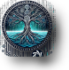
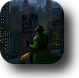
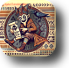
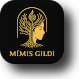

= Mímis Gildi: Rdd13r’s Living Digital Garden
Vadim Kuhay <12781006+rdd13r@users.noreply.github.com>
v10.3.0, Wednesday April 29th 2026
:description: Living and evolving publication repository by `rdd13r`.
:icons: font
:!toc:
:keywords: Mímir Rdd13r Résumé Hacker Vadim Kuhay
:releases: https://github.com/Mimis-Gildi/riddle-me-this/releases/[releases,window=_blank]
:actions: https://github.com/Mimis-Gildi/riddle-me-this/actions

:gha: https://github.com/Mimis-Gildi/riddle-me-this/actions/workflows
:a-qodana: {gha}/qodana.yml
:a-version: {gha}/incrementer.yml
:a-release: {gha}/releaser.yml
:a-stales: {gha}/stales.yml
:a-site: {gha}/pages-deploy.yml
:a-prune: {gha}/actions-prune.yml
:a-infra: {gha}/runner-introspect.yml

This is where I think out loud about engineering. +
Three decades building systems, leading teams, fixing what broke. +
This repo is my working notebook -- insights, field notes, code fragments, +
stories from production.
If something mattered, it's probably here.

'''

Everything to know about me and my values is in this repo. +
My people ethos and code attitude, feel for time, automation, LoLs. +
In the blog posts, workflows, release notes, commit history -- look around. +
Take what you like, if you dig my ways, come pair with me. +
_P.S. I use A LOT of custom ML_ +
_P.P.S. This repo has human and AI contributors working as a flat team. See link:CONTRIBUTING-HERE.adoc[CONTRIBUTING] and link:TEAM_NORMS.adoc[TEAM_NORMS]._

Public Site::
- **Browse the live site**: https://mimis-gildi.github.io/riddle-me-this/[Creative Engineering at Scale,window=_blank];
- **Learn more about the maintainer**: https://mimis-gildi.github.io/riddle-me-this/maintainer/[Maintainer,window=_blank];
- **Trends you won’t hear from Gartner**:
https://mimis-gildi.github.io/riddle-me-this/series/[Curated Series Collections,window=_blank];
- Or simply https://mimis-gildi.github.io/riddle-me-this/feed.xml[my RSS feed,window=_blank].
Profiles:::
* GitHub: https://rdd13r.github.io/ | https://rdd13r.github.io/rdd13r/
* LinkedIn: https://www.linkedin.com/in/rdd13r
* image:https://img.shields.io/badge/Follow-Medium-black?style=for-the-badge&logo=medium[Follow on Medium,link=https://medium.asei.systems,window=_blank]
image:https://img.shields.io/badge/Subscribe-LinkedIn-0A66C2?style=for-the-badge&logo=linkedin[Subscribe on LinkedIn,link=https://www.linkedin.com/build-relation/newsletter-follow?entityUrn=7074840676026208257,window=_blank]

== Contact

* Email: mailto:vadim@asei.systems[vadim@asei.systems] | mailto:rIdd13r@pm.me[rIdd13r@pm.me] <- crypted
* Signal / Discord / Text: +1 (919) 717-1387 ([bot]) / _https://github.com/Mimis-Gildi/riddle-me-this/releases/download/v10.3.0/VadimKuhay-Resume.pdf[Résumé]_

_Still, the best way to get to know me is to make software *with* me_ +
{nbsp} +
{nbsp}

image:./site/assets/images/badge-hera-button.png[Gervi Héra Vitr,link="https://github.com/Gervi-Hera-Vitr"]
image:./site/assets/images/badge-scala-button.png[Mímis Scala,link="https://github.com/Mimis-Scala"]

'''

_Timesaving {actions}[booms] ..._

[cols=">1,>1,>1,>1",%autowidth,frame=none,align=center,grid=none]
|===

a| image::{a-qodana}/badge.svg[Qodana,link={a-qodana},window=_blank,opts=nofollow]
a| image::{a-version}/badge.svg[Increment Version,link={a-version},window=_blank,opts=nofollow]
a| image::{a-release}/badge.svg[Publish Release,link={a-release},window=_blank,opts=nofollow]
a| image::{a-site}/badge.svg[Publish Site,link={a-site},window=_blank,opts=nofollow]

a| image::{a-stales}/badge.svg[Stale Issues,link={a-stales},window=_blank,opts=nofollow]
a| image::{a-prune}/badge.svg[Actions Prune,link={a-prune},window=_blank,opts=nofollow]
a| image::{a-infra}/badge.svg[Runner Introspect,link={a-infra},window=_blank,opts=nofollow]
a|

|===

'''
