# Security Policy

- NO security guarantees of any kind.
- NO support for any security features.
- Safety is responsibility of the user. 

Organization-wide security policies may apply. See: [fluffle organization repository](https://github.com/Mimis-Gildi).

___

## On _These_ Secure Ops

- [**GitHub Advanced Security**][gh-security] - main dashboard (Overview);
  - [Dependabot alerts][this-dependabot] - see GitHub Advanced Security [documentation][on-dependabot];
  - [Code scanning][code-scan] - general GitHub CodeQL (Advanced) [documentation][on-codeQL];
  - [Secret scanning alerts][secrets-scan] - accumulator for GitHub [secrets scanner][on-secret-scanning];
  - Running [advisories] - check here for any outstanding issues;
  - See our [security policy], i.e., _`this` document_ here.
- The [Mímis Gildi Qodana Organization] _**Dashboard**_ - a [Qodana Cloud] GitHub-App:
    - The [Scene Team] of Qodana Cloud @ [Mímis Gildi];
    - See the [Author]'s organizations and [open communities] sprinkled about. 
- The [Codacy Cloud Organizations] _**Dashboards**_ - a [Codacy Cloud] GitHub-App:
  - The [Mímis Gildi Codacy Organization] - containing this project and all the Ops domains;
  - The [Gervi Héra Vitr Codacy Organization] - i.e., [Captain]'s [Homeschool] and [classroom]. 
- The [`mend.io` Cloud Organizations] _**Dashboards**_ - a [mend.io] GitHub-App:
  - "Proactive" management is mend market, thus [Gervi Héra Vitr @mend] is _**the root org**_;
  - The [Sindri Labs @mend] is where _**next**_ democratized key enablement comes from;
  - Follow the Sindri Labs next [Current Issue (252) Dashboard] for your ops ideas;
  - As this is a schoolroom, things are _slower_, please watch their _[security panel]_.
- The [Dependabot] is a rock-bottom necessity as we have already linked [above][this-dependabot].
- _**Snyk**_: Once a decent platform: [Mimis-Vardr] project space (see [learn snyk]).
- IMPORTANT: On Agents - Mímir's Gildies run a ton of specialized [dedicated runners], so:
  - I take a lot of special care to run on public runners as much as possible;
  - If can't, all the _necessary_ information to customize your runner will be included. 

___

**Notice on ToDos**: _Having made the decisions to move all the [Author]'s publications here as the "canonical source of truth" some items will remain 
"in progress" until this artifact is fully wired into the `fluffle` Ops ecosystem and all the articles are migrated over._

___

_**This site version is [v2.3.0].**_

___

## Secure Automation Flow

The following diagram documents the secure automated release pipeline that governs all publishing activity within this repository:

```mermaid
---
title: Canonical Repository Actions Flow — Riddle-Me-This v2.3.0
config:
  theme: forrest
  curve: linear
  layout: dagre
---

flowchart TD
  IssueBranchMapped -..-o IssuesCreated
%% STATES
  StableTrunk((("`Stable Trunk
  'main' Origin`")))
  Branch((New Branch))
  FeatureBranch((Feature Branch))
  ReleaseBranch((Release Feature Branch))
  SecurityBranch((Security Branch))
  FeaturePullRequest[[Feature Pull Request]]
%% EVENTS
  IssuesCreated{{New Issues/PR Created}}
  IssueBranchMapped{{Branch Mapped to an Issue}}
  BranchCreated{{Branch Created}}
  UserCreatedPR{{Used Created PR}}
%% ACTORS
  UserActor[/" 🧑‍ Contributor"\]
  PullingUserActor[/" 🧑‍ Contributor"\]
  SystemActor[GitHub]
  Renovate[\" 🤖 Renovate"/]
  Dependabot[\" 🤖 Dependabot"/]
%% FLOW

%%% Branch Creation Flow
  StableTrunk ---- Transition ----> Branch
  UserActor -. Observe .-> StableTrunk
  Renovate -. Observe .-> StableTrunk
  Dependabot -. Observe .-> StableTrunk
  UserActor -- Command --> SystemActor
  Renovate -- Command --> SystemActor
  Dependabot -- Command --> SystemActor
  UserActor -.-> IssuesCreated
  Renovate -.-> IssuesCreated
  Dependabot -.-> IssuesCreated
  Greet -..-o IssuesCreated
  SystemActor == CREATE ==> Branch
  UserActor == CREATE ==> Branch
  Branch -.-> IssueBranchMapped
  Branch -.-> BranchCreated
  VersioningActor -. Subscribe .-o BranchCreated
  Branch -. read .-o VersioningActor

  subgraph "`_Version on New Branch_`"
    VersioningActor["Version Action"]
    VersionNotMain{"`NOT - main
                  Branch`"}
    VersioningActor ==> VersionNotMain
    VersionNotMain -- YES --> VersionSleep5
    VersionSleep5[Sleep 5 seconds]
    VersionFilterFeatureBranch{"`🦪 Check if branch matches 
    issue-style 
    (e.g. 12-feature-title)`"}
    VersionSleep5 --> VersionFilterFeatureBranch
    VersionSwitchOnMajor{" 🏷️ Check for major label on issue"}
    VersionFilterFeatureBranch -- yes --> VersionSwitchOnMajor
    VersionBumpProperties[" 🧬 Bump properties version; M.m.p"]
    VersionSwitchOnMajor -- " Major: (M+1).0.0 " --> VersionBumpProperties
    VersionSwitchOnMajor -- " Minor: M.(m+1).0 " --> VersionBumpProperties
    VersionChangePush[" 📂 Commit and push new version"]
    VersionActionSummary[" 🏋️ Summary annotation"]
    VersionBumpProperties --> VersionChangePush
    VersionChangePush --> VersionActionSummary

  end

  VersionFilterFeatureBranch -. no - action .-x SecurityBranch
  VersionChangePush == PUSH ==> FeatureBranch

  subgraph "`_Welcome New User_`"
    Greet{"Greet first time contributors"}
  end

  PullingUserActor -- read --o FeatureBranch
  PullingUserActor == PUSH ==> FeatureBranch
  PullingUserActor -- create --> UserCreatedPR
  UserCreatedPR -. on .-o FeatureBranch

  subgraph "`Idempotent Release Notes`"
    NotesActor["Release Notes Action"]
    NotesSkip{"`not - main
not - dependabot
not - renovate
not - Pull Request`"}
    NotesActor ==> NotesSkip
    NotesSkip --> NotesExtractVersion
    NotesSkip --> NotesExtractPriorVersion
    NotesExtractVersion[Extract Target Version]
    NotesExtractPriorVersion[Extract Prior Version]
    NotesShortCircuit{"`Short-Circuit
on 
No-Increment`"}
    NotesCreateIfMissing{"`Create 
Release Notes 
IF 
Missing`"}
    NotesExtractVersion --> NotesShortCircuit
    NotesExtractPriorVersion --> NotesShortCircuit
    NotesShortCircuit -- Not Security Branch --> NotesCreateIfMissing
    NotesCommitIfCreated{Commit New Release Notes File}
    NotesCreateIfMissing --> NotesCommitIfCreated
    NotesExtractCommitMessages[Extract Commit Messages]
    NotesCommitIfCreated -. wait .-> NotesExtractCommitMessages
    NotesExtractChangedFiles[Extract Changed Files]
    NotesCommitIfCreated -. wait .-> NotesExtractChangedFiles
    NotesCreateIfMissing --> NotesExtractCommitMessages
    NotesCreateIfMissing --> NotesExtractChangedFiles
    NotesWriteReleaseFooter([Write Release Notes Footer])
    NotesExtractCommitMessages ==> NotesWriteReleaseFooter
    NotesExtractChangedFiles ==> NotesWriteReleaseFooter
    NotesCommitFooter[Commit Updated Footer]
    NotesWriteReleaseFooter ==> NotesCommitFooter
  end

  NotesActor == On Push ==o FeatureBranch
  NotesCommitIfCreated == PUSH ==> FeatureBranch
  NotesExtractCommitMessages -- fetch --o FeatureBranch
  NotesExtractChangedFiles -- fetch --o FeatureBranch
  NotesCommitFooter == PUSH ==> FeatureBranch

  subgraph "Label Pull Request"
    LabelPullRequest[Label Pull Request]
    LabelingRules[[.github/labeler.yml]]
    LabelSite([Site Changed Label])
    LabelResume([Resume Changed Label])
    LabelSite -.-> LabelPullRequest
    LabelResume -.-> LabelPullRequest
    LabelingRules --> LabelPullRequest
  end
  LabelPullRequest -- write labels --> FeaturePullRequest
  LabelSite == Enable Site ==> ReleaseBranch
  LabelResume == Enable Resume ==> ReleaseBranch
  FeatureBranch --> FeaturePullRequest
  FeaturePullRequest --> ReleaseBranch
  FeaturePullRequest -..-> IssuesCreated

  subgraph Manage Stale Issues
    LabelStaleIssue([Label Stale Issue])
    LabelStalePR([Label Stale PR])
    StaleAction[Stale Issue Action]
    LabelStaleIssue --o StaleAction
    LabelStalePR --o StaleAction
  end

  StaleAction -. subscribe .-> IssuesCreated
  
  subgraph GitHub Actions Prune 
      WorkflowPruneAction[Prune Workflow Runs]
  end

  subgraph GitHub Action Caches Prune
    CachesPruneAction[Prune Workflow Caches]
  end

  WorkflowPruneAction -. subscribe .-> IssuesCreated
  CachesPruneAction -. subscribe .-> IssuesCreated
  
  
  subgraph PR Security Checks
      subgraph Security Scan by CodeQL 
          CodeQLAction[CodeQL Security Action]
      end
      
      subgraph Security Scan by Codacy
          CodacyAction[Codacy Security Action]
      end
      
      subgraph Security Scan by Qodana 
          QodanaAction[Qodana Security Action]
      end
      
      subgraph Security Scan by Snyk 
          SnykAction[Snyk Security Action]
      end
  end
  
  CodeQLAction -. subscribe .-> IssuesCreated
  CodacyAction -. subscribe .-> IssuesCreated
  QodanaAction -. subscribe .-> IssuesCreated
  SnykAction -. subscribe .-> IssuesCreated
```

___

[v2.3.0]: https://github.com/Mimis-Gildi/riddle-me-this/releases/tag/v2.3.0 "This release tag to follow."

[Author]: https://github.com/rdd13r "❤️ Kotlin ❤️ Scala; Python; Java; Go."
[Captain]: https://github.com/CaptainLugaru "Captain Lugaru: I am a coding Viking Bunny. In 2021, I won internship at ASE Inc." 
[open communities]: https://mimis-gildi.github.io/riddle-me-this/community/ "Open Communitites of one J Random Hacker Homeschooling CLub."

[Mímis Gildi]: https://github.com/Mimis-Gildi "The Mímis Gildi GitHub Organization: At Yggdrasil, drinking from Mímisbrunnr. This is for the thinking."
[Gervi Héra Vitr]: https://github.com/Gervi-Hera-Vitr "The Gervi Héra Vitr GitHub Organization: Gervi Héra Vitr is a space where ancient wisdom meets modern coding fluffle innovations."
[gh-security]: https://github.com/Mimis-Gildi/riddle-me-this/security "Security overview of this blogsite and artifacts."
[this-dependabot]: https://github.com/Mimis-Gildi/riddle-me-this/security/dependabot "Dependabot deprecations as outlined in this repo."
[on-dependabot]: https://docs.github.com/en/get-started/learning-about-github/about-github-advanced-security "On Dependabot of GH-AS."
[code-scan]: https://github.com/Mimis-Gildi/riddle-me-this/security/code-scanning "Code scan with CodeQL."
[on-codeQL]: https://docs.github.com/en/code-security/codeql-cli/using-the-advanced-functionality-of-the-codeql-cli/advanced-setup-of-the-codeql-cli "CodeQL CLI."
[secrets-scan]: https://github.com/Mimis-Gildi/riddle-me-this/security/secret-scanning "Secrets violation dashboard."
[on-secret-scanning]: https://docs.github.com/en/code-security/secret-scanning/introduction/about-secret-scanning "About secret scanning."
[advisories]: https://github.com/Mimis-Gildi/riddle-me-this/security/advisories "GitHub security portal advisories."
[security policy]: https://github.com/Mimis-Gildi/riddle-me-this/security/policy "Security Policy."

[Qodana Cloud]: https://qodana.cloud/ "Qodana Cloud from JetBrains; ❤️ 😍 🔥"
[Mímis Gildi Qodana Organization]: https://qodana.cloud/organizations/AY0jm "Qodana orzanization for Mímis Gildi."
[Scene Team]: https://qodana.cloud/teams/zqLmn "The Scene Team of Mímis Gildi."

[Codacy Cloud]: https://www.codacy.com "Codacy: End-to-End protection, ready for AI Coding."
[Codacy Cloud Organizations]: https://app.codacy.com/organizations "Codacy ensures top-notch Security-as-a-Service in minutes."
[Gervi Héra Vitr Codacy Organization]: https://app.codacy.com/organizations/gh/Gervi-Hera-Vitr/dashboard "Codacy organization for Gervi Héra Vitr."
[Mímis Gildi Codacy Organization]: https://app.codacy.com/organizations/gh/Mimis-Gildi/dashboard  "Codacy organization for Mímis Gildi."
[Homeschool]: https://github.com/orgs/Gervi-Hera-Vitr/projects/1 "Gervi Héra Viskr Learning Trails."
[classroom]: https://app.codacy.com/gh/Gervi-Hera-Vitr/sindri-labs/dashboard "Sindri Labs Classroom Dashboard."

[mend.io]: https://www.mend.io/ "Proactively manage application risk."
[`mend.io` Cloud Organizations]: https://developer.mend.io/ "Mend.io Gervi Héra Vitr Organization."
[Gervi Héra Vitr @mend]: https://developer.mend.io/github/Gervi-Hera-Vitr "Gervi Héra Vitr is a space where ancient wisdom meets modern coding fluffle innovations."
[Sindri Labs @mend]: https://developer.mend.io/github/Gervi-Hera-Vitr/sindri-labs "Sindri Labs mend.io Dashboard."
[Current Issue (252) Dashboard]: https://github.com/Gervi-Hera-Vitr/sindri-labs/issues/252 "Dependency Dashboard 252, GH local."
[security panel]: https://github.com/Gervi-Hera-Vitr/sindri-labs/security "Dependabot, GitHub native, effective and free, omnipresent option."

[Dependabot]: https://github.com/dependabot "GitHub Dependabot is the rock-bottom, but free and fundamental security tool for Munchkins worldwide."

[Mimis-Vardr]: https://app.snyk.io/ "Trust AI at full speed."
[learn snyk]: https://learn.snyk.io/user/learning-progress

[dedicated runners]: https://github.com/Mimis-Gildi/organization-runners "Mímis Gildi dedicated runners."
